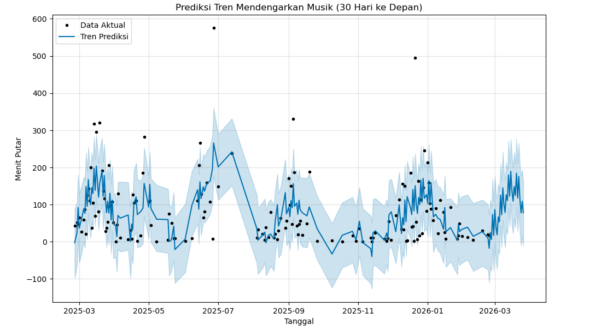

<h1>Isi Repositori</h1>
Pada Repositori ini kita akan mengeksplorasi data riwayat Listening History untuk memahami lagu favorit, artis favorit, dan memprediksi tren aktivitas musik di masa depan (seperti Spotify Wrapped)

<h1>Hasil Ekplorasi</h1>
Identifikasi 10 artis dan lagu teratas berdasarkan frekuensi pemutaran.
 
Identifikasi artis-artis yang lagunya paling sering dilewati.
 
Prediksi durasi mendengarkan musik 30 hari ke depan berdasarkan pola aktivitas setahun kebelakang.

<h1>Visualisasi</h1>
 

  
  
<i>Gambar: Prediksi Tren Aktivitas Mendengarkan Musik di Spotify 30 hari kedepan (2 Maret 2026)</i>

